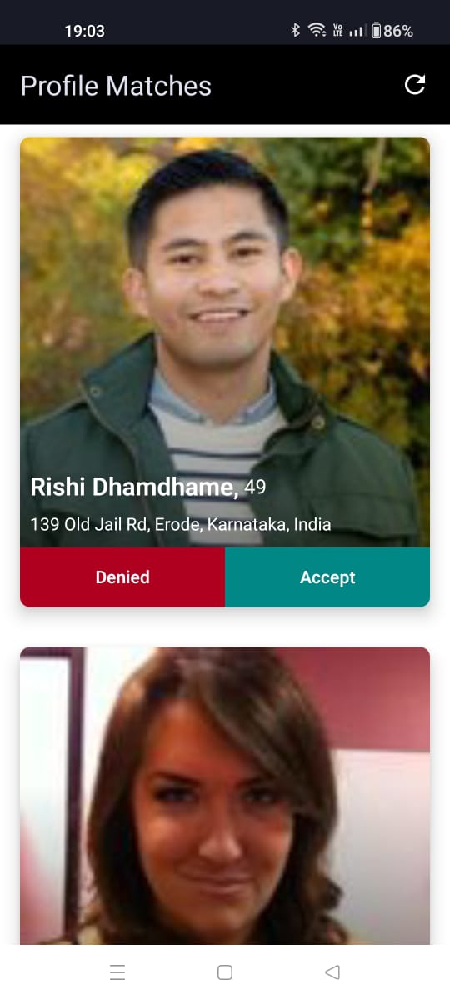
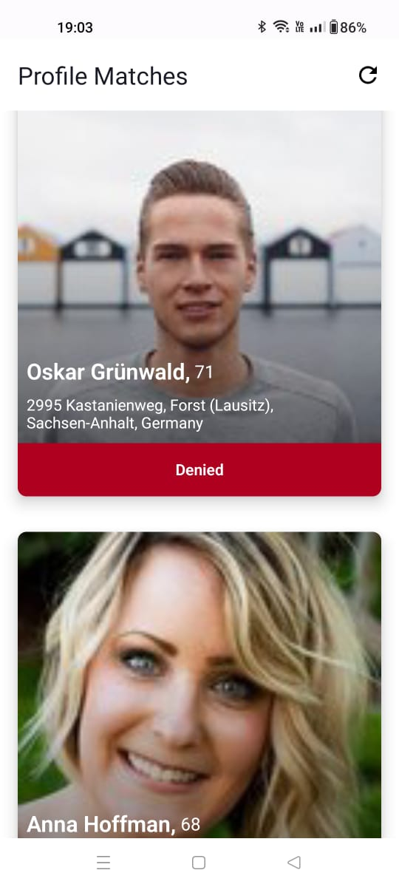

# Match Mate App

    
    

## Built with 

- [Kotlin](kotlinlang.org): Programming language
- [Jetpack Compose](https://developer.android.com/jetpack/compose): Jetpack compose is a modern android UI developement framework.
- [Coroutines](https://github.com/Kotlin/kotlinx.coroutines): For multithreading
- [Serialization](https://github.com/Kotlin/kotlinx.serialization): For JSON serialization/deserialization
- [Retrofit](https://github.com/square/retrofit): Performing API request 
- [Coil](https://github.com/coil-kt/coil): Image loading for Android
- [Room Database](https://developer.android.com/training/data-storage/room): Local Storage

## Architecture

Followed Clean Architecture.
You can read more about Android best practices and architecture [Android Architecture ](https://developer.android.com/topic/architecture#recommended-app-arch)
